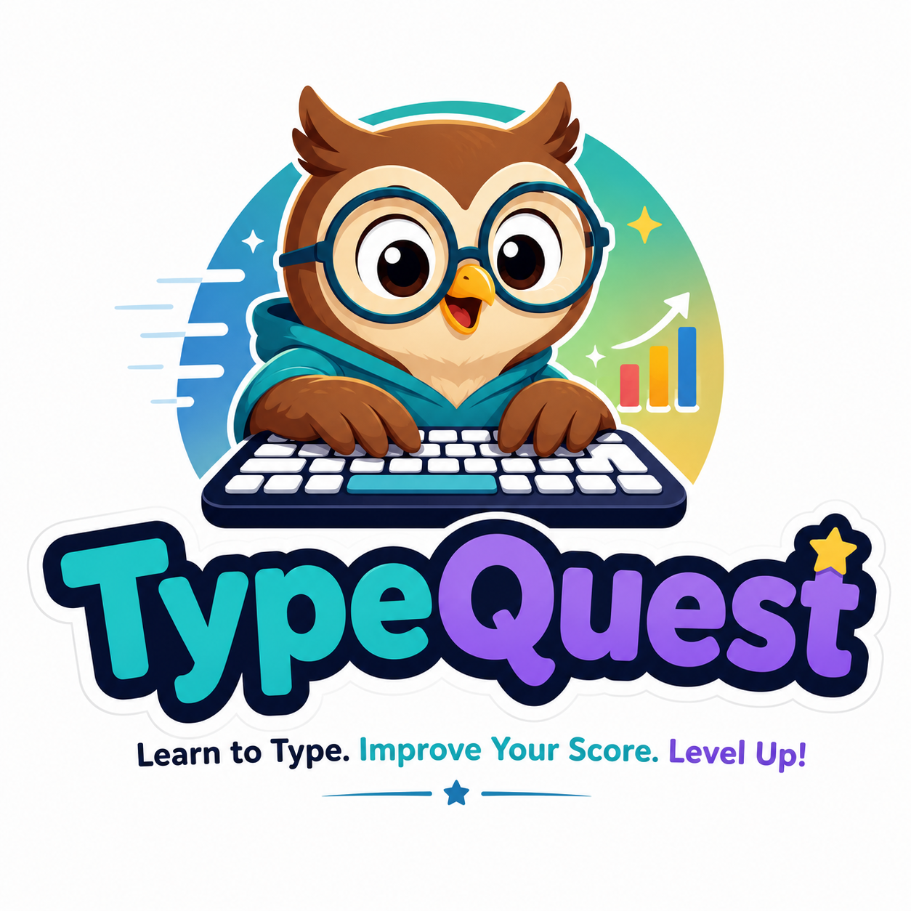

<div align="center">



<h1>Type Quest</h1>

<p><strong>Kid-friendly typing adventures, powered by AI</strong></p>

<p>
  <a href="https://nextjs.org"></a>
  <a href="https://react.dev"></a>
  <a href="https://supabase.com"></a>
  <a href="https://anthropic.com"></a>
</p>

<p>Embark on typing adventures! Kids log in, tackle AI-generated quests, and<br />compete on a global leaderboard — all while learning to type fast and accurately.</p>

</div>

---

## ✨ Features

- 🧭 **AI-Generated Adventures** — Every typing test is a fresh, themed story written by Claude Haiku
- ⌨️ **Interactive Virtual Keyboard** — Color-coded finger guides, next-key glow, and press animations
- 🏆 **Tier Progression** — Bronze → Silver → Gold → Diamond → Emerald → Platinum (30 levels)
- 🔥 **Daily Streak System** — Keep your streak alive for up to 1.5× point multiplier
- 📊 **Global Leaderboard** — Weekly and all-time rankings across all players
- 👤 **Customizable Profiles** — 30+ emoji avatars, color themes, and editable names
- 🎉 **Confetti Results** — Score, WPM, accuracy, errors, time, and backspace tracking
- 🛡️ **PIN-Based Login** — Kid-safe: name + 4-digit PIN (no email required)
- 🎮 **Demo Mode** — Runs entirely in your browser with zero backend config

---

## 🎮 How It Works

1. **Sign In** — Enter your name and a 4-digit PIN. New? Your PIN creates your account automatically.
2. **Start an Adventure** — Hit "Generate My Adventure" and Claude Haiku writes a unique typing quest based on your level.
3. **Type!** — Follow the highlighted prompt. The virtual keyboard shows which finger to use and which key is next.
4. **See Results** — Confetti + stats: score, WPM, accuracy, errors, time, backspaces.
5. **Level Up** — Points stack up. Tier badges unlock. Climb the leaderboard. Build your streak.

---

## 🏆 Tier System

Epic Books–style progression based on cumulative score:

| Tier | Sub-levels | Point Thresholds |
|---|---|---|
| 🥉 Bronze | 1–5 | 0 — 1,000 |
| 🥈 Silver | 1–5 | 1,500 — 5,000 |
| 🥇 Gold | 1–5 | 6,500 — 18,000 |
| 💎 Diamond | 1–5 | 23,000 — 55,000 |
| 🟢 Emerald | 1–5 | 68,000 — 160,000 |
| 🔷 Platinum | 1–5 | 200,000 — 500,000 |

**Points formula:**

```
score = floor((10 + wpm + round(accuracy × 0.5) + level × 2) × streakMultiplier)
```

| Streak | Multiplier |
|---|---|
| Day 1 | 1.0× |
| Days 2–3 | 1.1× |
| Days 4–6 | 1.2× |
| Day 7+ | 1.5× |

Missed a day? Streak resets + 50-point penalty.

---

## ⚡ Quick Start

```bash
git clone https://github.com/angusgastle/typequest.git
cd typequest
npm install
npm run dev
```

Open [http://localhost:3000](http://localhost:3000), type a name + any 4-digit PIN, and start typing!

> **Demo Mode** — With no environment variables set, the app runs entirely on `localStorage`. No Supabase, no API keys needed.

---

## 🔧 Full Setup

### Supabase (persistence)

1. Create a project at [supabase.com](https://supabase.com)
2. Run `supabase/schema.sql` in the SQL editor
3. Copy `.env.example` → `.env.local` and fill in:

```bash
NEXT_PUBLIC_SUPABASE_URL=...
NEXT_PUBLIC_SUPABASE_ANON_KEY=...
SUPABASE_SERVICE_ROLE_KEY=...
```

With these present, the app automatically switches from localStorage to Supabase.

### Anthropic (AI adventures)

Add your API key (get one at [console.anthropic.com](https://console.anthropic.com)):

```bash
ANTHROPIC_API_KEY=...
```

With a key, `/api/generate-test` calls **Claude Haiku** for themed adventures. Without it, a local content generator is used as fallback.

---

## 🚀 Deploy

```bash
vercel
```

Set the same environment variables in your Vercel project dashboard. Done.

---

## 🛠 Tech Stack

| Layer | Technology |
|---|---|
| Framework | [Next.js 16](https://nextjs.org) (App Router, React 19) |
| Styling | [Tailwind CSS v4](https://tailwindcss.com) + [Framer Motion](https://motion.dev) |
| Database | [Supabase](https://supabase.com) (Postgres + RLS) |
| AI | [Anthropic Claude Haiku](https://anthropic.com) |
| Linting | [Biome](https://biomejs.dev) |
| Deployment | [Vercel](https://vercel.com) |

---

## 📁 Project Structure

```
src/
├── app/
│   ├── layout.tsx          # Root layout, fonts, metadata
│   ├── page.tsx            # Login page
│   ├── icon.png            # Favicon (auto-served)
│   ├── apple-icon.png      # Apple touch icon
│   ├── opengraph-image.png # Social sharing image
│   ├── adventure/page.tsx  # Main typing test flow
│   ├── leaderboard/page.tsx# Global rankings
│   ├── profile/page.tsx    # Avatar, stats, PIN management
│   └── api/                # API routes (login, generate-test, submit, etc.)
├── components/
│   ├── Keyboard.tsx        # Virtual keyboard with finger guides
│   ├── TypingTest.tsx      # Core typing test component
│   ├── NavBar.tsx          # Navigation bar
│   ├── BackgroundBlobs.tsx # Animated background
│   ├── Confetti.tsx        # Celebration effects
│   └── ui.tsx              # Shared UI components
└── lib/
    ├── data.ts             # Data access (Supabase + demo mode)
    ├── generate-test.ts    # AI test generation
    ├── types.ts             # TypeScript interfaces
    ├── utils.ts             # Tiers, avatars, streaks, helpers
    └── supabase.ts         # Supabase client
```
